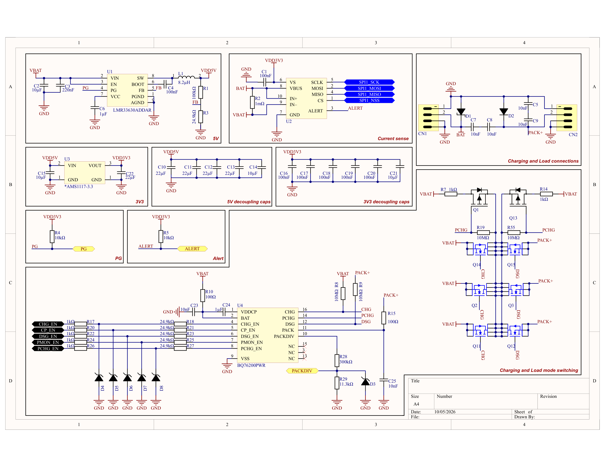

# 7S BMS

Battery management system for a 7-series battery stack. Built around an STM32F103 with an LTC6811-2 cell monitor, an INA239 high-side shunt monitor and a BQ76200 high-side N-FET driver.

I led the design of this board from scratch: requirements, component selection, schematic (Altium Designer), PCB layout, manufacturing, assembly, bring-up and test. The board was built and works in its application.

The firmware was written by the software team. My side of that work was the hardware/firmware interface: pin assignment, bus settings, register configuration of the INA239, LTC6811 and BQ76200, and the start-up order. It is summarised in [docs/07](docs/07-firmware-interface.md).

| Contributor | Role |
|---|---|
| Orxan ([@dadashovf8](https://github.com/dadashovf8)) | Hardware lead: requirements, schematic, component selection, PCB layout, manufacturing, bring-up and test, HW/FW interface |
| Shamil Mammadov ([@shamilmamedov340-ops](https://github.com/shamilmamedov340-ops), [LinkedIn](https://www.linkedin.com/in/shamil-mammadov-419995326)) | Schematic design and component selection |

**Not in this repository:** the PCB layout and photos of the finished product. The project was done for an employer, and those parts are proprietary. Schematic and BOM are published.

| | |
|---|---|
| Schematic | [hardware/BMS_schematic_revA.pdf](hardware/BMS_schematic_revA.pdf) (3 sheets) |
| BOM | [hardware/BOM_revA.csv](hardware/BOM_revA.csv) (47 lines, 143 parts) |
| Design notes | [docs/](docs) |
| Calculations | [calc/bms_calc.py](calc/bms_calc.py) → [calc/results.md](calc/results.md) |



## Specification

| Parameter | Value |
|---|---|
| Cells | 7 in series |
| Stack voltage | 11 – 36 V (LTC6811 V+ min, LMR33630 V_IN max) |
| Cell measurement | LTC6811-2, 16-bit ΔΣ, 1.2 mV max total error |
| Current measurement | 1 mΩ high-side shunt + INA239, ±40.96 A at 1.25 mA/LSB |
| Switching | High side, 3 × back-to-back BSC010N04LS (0.67 mΩ path), common drain |
| Precharge | P-FET path, 500 Ω current limit |
| Pack-terminal voltage | BQ76200 switched divider, ×27.55 |
| Temperature | 3 × 10 kΩ NTC, ratiometric to VREF2 |
| Balancing | Passive, external P-FET, 50 Ω per cell |
| Supply | LMR33630 buck 5.0 V → AMS1117 3.3 V |
| MCU | STM32F103C8T6, 72 MHz |
| Connectors | XT60 battery and pack, JST XH balance and UART, JST SH SWD |

## Where it fits

A 7-series stack sits in the 24 V class. That is the bus voltage of a lot of equipment that runs on a rechargeable pack and has to be safe to charge, carry and leave unattended:

- light electric vehicles: e-bikes, scooters, mobility aids
- mobile robots and AGVs
- cordless tools and garden equipment
- portable power stations and 24 V backup supplies
- small solar or off-grid storage

In each of these, the BMS is what separates a battery from a product. What this board does:

- **Keeps every cell inside its limits.** Each cell is measured individually, and the pack is disconnected on over-voltage, under-voltage, overcurrent or temperature. A pack is only as good as its weakest cell, and a single cell pushed past its limit is the usual start of a failure.
- **Extends pack life.** Balancing pulls high cells back into line, so the usable capacity does not shrink with every cycle as the cells drift apart.
- **Charges a deeply discharged pack gently.** The precharge path limits the current until the cells recover.
- **Knows what the pack is doing.** Cell voltages, current, temperature and charge counted over time are available to the firmware and can be reported over UART to a display, a logger or a host system.
- **Keeps one ground.** Switching on the high side means the host can talk to the BMS without isolation, whatever state the switches are in.

The LTC6811 has 12 channels, so the same architecture scales to larger stacks with a different supply stage.

## Architecture

```
CELL0..7 ─► LTC6811-2 ─── SPI2 ───────────┐
                                          ▼
BAT+ ─ 1 mΩ ─ VBAT ═ CHG ═╦═ DSG ═ PACK+   STM32F103 ── UART / SWD
        │                 ╚═ PCHG ═ VBAT      │
      INA239 ── SPI1 ────────────────────────►│
                       BQ76200 ◄── 5 × EN ────┘
VBAT ─► LMR33630 5 V ─► AMS1117 3.3 V
```

- **High-side switching** keeps battery, board and pack on one ground, so communication lines need no isolation or level shifting.
- **Firmware makes every protection decision.** The analog front end measures and the gate driver executes.
- **Two SPI buses** separate the fast current monitor (10 MHz, mode 1) from the cell monitor (1 MHz, mode 3).
- **Balancing ends on its own.** The LTC6811 discharge timer turns the bleed FETs off after the programmed time, even if communication stops.

## Design notes

| # | Document | Contents |
|---|---|---|
| 1 | [System](docs/01-system.md) | Ratings, block diagram, switch states, power tree |
| 2 | [Power](docs/02-power.md) | 5 V buck against the TI reference design, 3.3 V LDO, decoupling |
| 3 | [Current sense](docs/03-current-sense.md) | Shunt, INA239 range and calibration, error terms, ALERT |
| 4 | [Protection switch](docs/04-protection-switch.md) | FET topology, BQ76200, enable network, switching times, precharge, pack voltage, transients |
| 5 | [Cell monitor](docs/05-cell-monitor.md) | LTC6811 pins, cell mapping, filter, balancing, NTCs |
| 6 | [MCU](docs/06-mcu.md) | Pin map, clocks, reset, boot, debug |
| 7 | [HW/FW interface](docs/07-firmware-interface.md) | SPI modes, register settings, measurement sequence, start-up order |
| 8 | [BOM](docs/08-bom.md) | Part selection and counts |
| - | [References](docs/references.md) | Datasheets used |

## Repository

```
hardware/   schematic (PDF) and BOM (CSV), exported from Altium
docs/       design notes
calc/       design calculations (Python 3, standard library only)
img/        sheet renders
```

To reproduce the numbers in docs/:

```
python calc/bms_calc.py > calc/results.md
```
